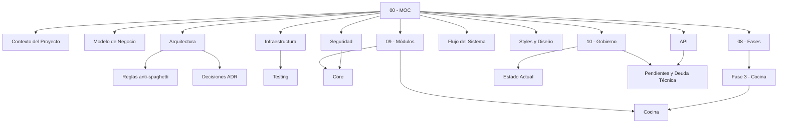

# ServidOS Front — Mapa de Contenido

> [!abstract] Qué es esta bóveda
> Documentación del cliente Angular de ServidOS (`D:\servidos-frontend\front`). Cada nota es atómica, cita rutas del repositorio y separa lo **verificado en código/docs** de lo **anunciado sin verificar**. Su objetivo: que cualquiera entienda qué hace el proyecto y pueda extenderlo sin romperlo ni convertirlo en spaghetti. El backend tiene su propia bóveda (`ServidOS - MOC` en el repo del backend).

> [!info] Estado del módulo Cocina
> Cocina está **implementada** en la rama `feat/cocina` (hasta `2fad5cb`), pero sin prueba manual en navegador, con payload sin verificar contra Swagger y con la review nativa pendiente. Ver [[Fase 3 - Cocina]] y [[Estado Actual]].

## Navegación

### 01 - Contexto
- [[Contexto del Proyecto]] — qué es, alcance, stack, cómo ejecutarlo
- [[Modelo de Negocio]] — multi-tenant, suscripción, roles, estados de pedido
- [[Glosario]] — términos del dominio y del código

### 02 - Arquitectura
- [[Arquitectura]] — capas, rutas como fuente única, ventajas y desventajas
- [[Reglas anti-spaghetti]] — checklist de qué va dónde y qué no hacer
- [[Decisiones (ADR)]] — decisiones tomadas con contexto y trade-offs

### 03 - Infraestructura
- [[Infraestructura]] — build, proxy, dependencias, flujo git
- [[Testing]] — Vitest, TDD, qué se testea y qué no

### 04 a 07
- [[Seguridad]] — token en memoria, refresh, guards, riesgos
- [[API]] — contrato `/api/v1`, errores, endpoints, cambios anunciados
- [[Flujo del Sistema]] — diagramas de arranque, login, refresh, guards, pedido, cocina en vivo
- [[Styles y Diseño]] — tokens Tailwind 4, tipografía, primitivas, índice de pantallas

### 08 - Fases
- [[Fase 0 - Infra]] · [[Fase 1 - Core Auth]] · [[Fase 2 - Login y Shell]] · [[Fase 3 - Cocina]] · [[Fases 4-9 - Planificadas]]

### 09 - Módulos
- [[Core]] · [[Shared]] · [[Auth]] · [[Cocina]] · [[Restaurante]] · [[Pedidos]] · [[Pagos]] · [[Catálogo]] · [[Usuarios]] · [[Plataforma]]

### 10 - Gobierno
- [[Estado Actual]] — qué está hecho, rama, siguiente paso
- [[Pendientes y Deuda Técnica]] — todo lo abierto, incluido el checklist de cambios del backend

## Mapa de notas

> [!tip] Orden de lectura sugerido para alguien nuevo
> [[Contexto del Proyecto]] → [[Modelo de Negocio]] → [[Arquitectura]] → [[Reglas anti-spaghetti]] → [[Seguridad]] → el módulo que vaya a tocar en [[Core]] / [[Cocina]].

## Fuentes del repositorio
`AGENTS.md`, `README.md`, `docs/FRONTEND_CONTEXT.md`, `docs/Flujo - Recepcion Cocina.md`, `docs/DESIGN_BRIEF.md`, `docs/frontend-alineacion-seguridad.md`, `docs/progress/*.md`, `odd/tasks/*.md`, y el código bajo `src/`.
