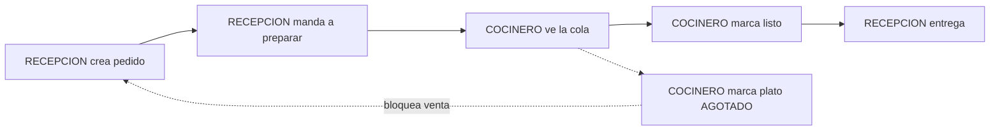

# Modelo de Negocio

> [!abstract] Fuentes
> `docs/Flujo - Recepcion Cocina.md` (decisión con el dueño, 2026-10-02), `docs/FRONTEND_CONTEXT.md` §3, §5, §7 y la tabla real del código `src/app/core/auth/domain/permissions.rules.ts`. El backend sigue siendo la autoridad; el front solo oculta lo que de todas formas daría 403.

Volver: [[00 - MOC]] · Relacionado: [[Seguridad]] · [[API]] · [[Glosario]]

## Multi-tenant
- Cada restaurante es un tenant. El `restauranteId` **sale del JWT** en el backend; nunca va en el JSON ni se pide en formularios (`FRONTEND_CONTEXT` §3).
- Una sesión con `restauranteId === null` es de **plataforma**; con valor, de **restaurante** (`scopeOf` en `permissions.rules.ts`).

## Suscripción y paywall
- Estados de suscripción en el contrato: `ACTIVA` / `CANCELADA`; estados de restaurante: `ACTIVO` / `INACTIVO`.
- Contrato vigente en `FRONTEND_CONTEXT` §5: un tenant `CANCELADA` lee pero no escribe (402). Las fechas eran informativas.
- Hoy el front: el `errorInterceptor` redirige a `/paywall` (ADMINISTRADOR) o `/suspendido` (otros) ante un 402. Ver [[Seguridad]] y [[Restaurante]].

> [!warning] Cambio anunciado por backend (2026-10-08), sin verificar contra Swagger
> El modelo de suscripción cambia: `CANCELADA` sigue operando hasta `fechaFin`; el 402 aplica solo si el restaurante está `INACTIVO`, no tiene suscripción vigente o `fechaFin < hoy`; el tenant ya no se auto-renueva (la plataforma regulariza). Detalle y checklist en [[API]] y [[Pendientes y Deuda Técnica]].

## Roles
Vocabulario cerrado (`src/app/core/auth/auth.types.ts`):

| Ámbito | Roles | Observación |
|---|---|---|
| Plataforma | `SUPERADMIN`, `ADMIN`, `MODERADOR` | jerarquía `SUPERADMIN > ADMIN > MODERADOR`: nadie otorga un rol igual o superior (`canGrantPlatformRol`) |
| Restaurante | `ADMINISTRADOR`, `RECEPCION`, `COCINERO`, `MESERO`, `CAJERO`, `REPARTIDOR` | `MESERO/CAJERO/REPARTIDOR` existen sin permisos activos (YAGNI según el Flujo) |

### Matriz de acciones (UI)
Tomada de `permissions.rules.ts` (`PLATFORM_ACTIONS` y `RESTAURANTE_ACTIONS`). `X` = permitido.

| Acción | SUPERADMIN | ADMIN | ADMINISTRADOR | RECEPCION | COCINERO | MESERO / CAJERO / REPARTIDOR | MODERADOR |
|---|---|---|---|---|---|---|---|
| `plataforma.restaurantes.ver` | X | | | | | | |
| `plataforma.restaurantes.crear` | X | X | | | | | |
| `restaurante.ver` | | | X | X | X | X | |
| `restaurante.suscripcion.gestionar` | | | X | | | | |
| `catalogo.ver` | | | X | X | X | X | |
| `catalogo.editar` | | | X | | | | |
| `catalogo.disponibilidad` | | | X | | X | | |
| `pedidos.gestionar` | | | X | X | | | |
| `pagos.registrar` | | | X | | | | |
| `pagos.reembolsar` | | | X | X | | | |
| `usuarios.gestionar` | | | X | | | | |
| `cocina.ver` / `cocina.listo` | | | X | X | X | | |

> [!tip] Por qué RECEPCION puede reembolsar pero no cobrar
> Es exactamente la matriz del contrato (`Flujo - Recepcion Cocina.md`). La review lo marcó como inusual pero intencional (`docs/progress/03`).

### Home por rol (`homeFor`)
| Rol | Destino |
|---|---|
| SUPERADMIN | `/plataforma/restaurantes` |
| ADMIN (plataforma) | `/plataforma/restaurantes/nuevo` |
| ADMINISTRADOR, RECEPCION | `/pedidos/nuevo` |
| COCINERO | `/cocina` |
| MODERADOR, MESERO, CAJERO, REPARTIDOR | `/sin-modulos` |

> [!note] Observación derivada del código
> MESERO/CAJERO/REPARTIDOR tienen `catalogo.ver`, así que el menú les mostraría "Catálogo" aunque su home sea `/sin-modulos`. Es una consecuencia de las reglas actuales; no hay documentación que diga si es deseado. Ver [[Pendientes y Deuda Técnica]].

## Flujo operativo Recepción a Cocina

Un producto `AGOTADO` no se puede pedir: el backend responde 400 (`Producto no disponible: {id}`); el front puede filtrar pero la garantía es del dominio.

## Pedidos: tipos y estados
- Tipos (`TipoPedido`): `MESA` (exige `mesaId`), `DELIVERY`, `RECOJO`.
- Estados (`EstadoPedido`): `PENDIENTE`, `EN_PREPARACION`, `LISTO`, `EN_ENTREGA`, `ENTREGADO`, `CANCELADO`.
- Transiciones (doc de Flujo, regla 5): `PENDIENTE → EN_PREPARACION → LISTO → ENTREGADO` (MESA/RECOJO) o `LISTO → EN_ENTREGA → ENTREGADO` (DELIVERY); `CANCELADO` hasta `LISTO`; un pedido pagado no se cancela (400).
- Diagrama completo con actores: [[Flujo del Sistema]].

> [!warning] Cambios anunciados (2026-10-08), sin verificar
> Reembolso cancela el pedido si no está `ENTREGADO` y un pedido reembolsado no se vuelve a cobrar (400); en DELIVERY, `EN_ENTREGA → CANCELADO` se permite si no está pagado y `ENTREGADO` sin pago es válido. Ver [[API]].

## Qué NO existe (según `FRONTEND_CONTEXT` §9)
`MeResponse.suscripcionVigente`, filtros en el dashboard de plataforma, `PUT` de edición de pedido, entidad `mesa`, facturación/SUNAT. Y los listados `GET /pedidos` y `GET /usuarios` (backlog backend, `docs/progress/01`). Nota: §9 aún dice que no hay WebSockets de cocina, pero §7 del mismo documento ya los describe (ver [[Pendientes y Deuda Técnica]]).
