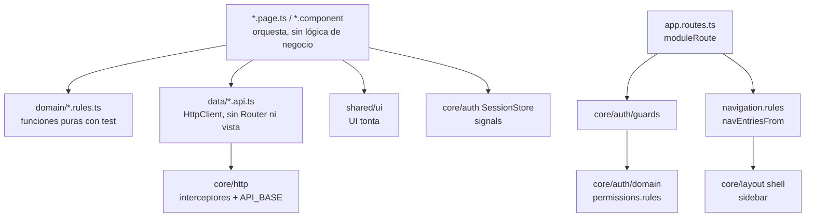
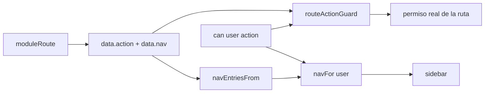

# Arquitectura

> [!abstract] Idea central
> Modular por dominio. Cada feature separa **datos** (`data/*.api.ts`), **reglas puras** (`domain/*.rules.ts`) y **vista** (`*.page.ts`, que solo orquesta). Las **rutas** son la única fuente de verdad de permisos y menú.

Volver: [[00 - MOC]] · Ver también [[Reglas anti-spaghetti]] · [[Decisiones (ADR)]] · [[Core]] · [[Shared]]

## Estructura (`AGENTS.md` §4 y árbol real de `src/app`)
```
src/app/
  app.config.ts / app.routes.ts / app.ts   arranque, rutas, raíz
  core/        auth (store, api, rules, guards), http (interceptores, tipos), layout (shell)
  features/    auth, cocina, restaurante (+ catálogo, pedidos, pagos, usuarios, plataforma: aún sin carpeta)
  shared/      ui (button, badge, icon, modal, state-panel, text-field, toast) y pages (403, 404, …)
src/testing/   builders.ts, mock-api.ts
```



## Capas y responsabilidades
| Capa | Archivos tipo | Puede depender de | No debe |
|---|---|---|---|
| Página | `*.page.ts` | rules, api, store, shared | contener reglas de negocio |
| Datos | `*.api.ts` | `HttpClient`, `API_BASE`, tipos | importar vista ni `Router` (salvo `core/http`) |
| Dominio | `*.rules.ts` | tipos, otras reglas puras | usar DI, HTTP o DOM |
| UI tonta | `shared/ui/*` | solo inputs/outputs | conocer API o sesión |

> [!note] Excepciones reales que conviene conocer
> `shell.layout.ts` (core) importa `RestauranteApi` de `features/restaurante` para el nombre del tenant, y `paywall.page.ts` usa `SessionStore` de core. Core depende puntualmente de una feature; está documentado como trade-off en `docs/progress/04`. Y `restaurante.rules` importa `BadgeVariant` de `shared/ui`: una regla de dominio que conoce un tipo de UI. Ver [[Pendientes y Deuda Técnica]].

## Standalone + signals
No hay NgModules. Estado en signals (`SessionStore.user`, `accessToken`, `ToastService.toasts`, estado local de páginas). Componentes con `ChangeDetectionStrategy.OnPush`. Datos remotos con `HttpClient` (`withFetch()`), RxJS solo donde es natural (peticiones, STOMP). Ver `src/app/app.config.ts`.

## Rutas lazy
Cada página se carga con `loadComponent: () => import(...)`. En la Fase 2 el initial bundle fue 283.80 kB raw (`docs/progress/04`). No se usa `loadChildren`: `navEntriesFrom` solo recorre `children` síncronos (advertencia de la review, ver [[Reglas anti-spaghetti]]).

## Rutas como fuente única (permisos + menú)
`moduleRoute(action, label, icon, guards = [], load)` en `src/app/app.routes.ts` devuelve:
- `canActivate: [routeActionGuard, ...guards]`
- `loadComponent`
- `data: routeAccess({ action, nav: { label, icon }, title })`

Luego:
- `routeActionGuard` lee `data.action` y aplica `can()`; sin acción deniega y envía a `/sin-permiso` (falla cerrado).
- `navEntriesFrom(router.config)` construye las entradas del menú; `navFor(user, entries)` filtra por `can()`.
- `homeLabel` y `sin-permiso.page.ts` reutilizan las mismas entradas.



> [!warning] Regla crítica
> Los guards extra van en el parámetro `guards` de `moduleRoute`, **nunca** como un `canActivate` posterior al spread: lo reemplazaría y la ruta perdería el guard de permisos (hallazgo R2-001, fix `484abaa`).

## Reglas de dependencia (resumen)
1. `*.api` / `*.service` nunca importan vista ni `Router` directo (salvo `core/http`).
2. `shared/ui` no depende de features ni de core.
3. `domain` es puro: sin Angular DI.
4. Un permiso se declara una vez (en la ruta) y se consulta con `can()`.

## Container-presentational
Las páginas (`login.page`, `paywall.page`, `shell.layout`) son contenedores: llaman al store/API, manejan señales y delegan formato y reglas a `domain`. Los componentes de `shared/ui` son presentacionales (inputs/models, sin servicios; la excepción funcional es `toast-host`, que lee `ToastService`).

## Ventajas y desventajas
| Ventajas | Desventajas |
|---|---|
| Un solo lugar por permiso: menú y guard no pueden divergir | `Route.data` es débilmente tipado; se mitiga con `routeAccess()` pero depende de disciplina |
| Reglas puras fáciles de testear sin TestBed | Más archivos por feature (`api`, `rules`, `page`) para cambios pequeños |
| Lazy por ruta: bundle inicial pequeño | `navEntriesFrom` no ve `loadChildren`; el shell lee las rutas una sola vez |
| Falla cerrado: ruta sin acción = denegada | Duplicación menor: `SuscripcionApi` (core) y `RestauranteApi.suscripcion()` hacen el mismo GET |
| Capas explícitas evitan servicios que manipulan vistas | Core depende de una feature (shell → `RestauranteApi`) |
