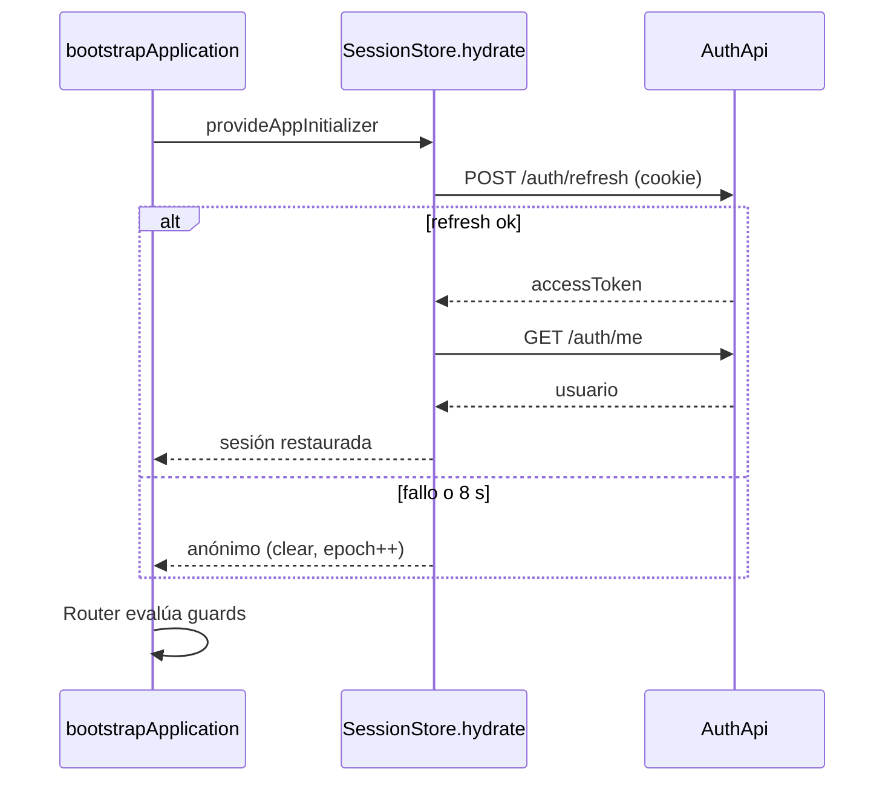
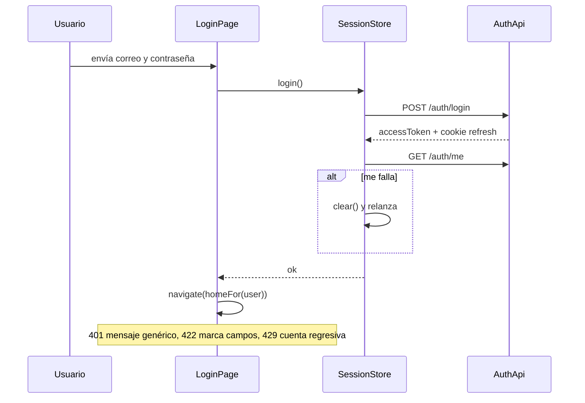
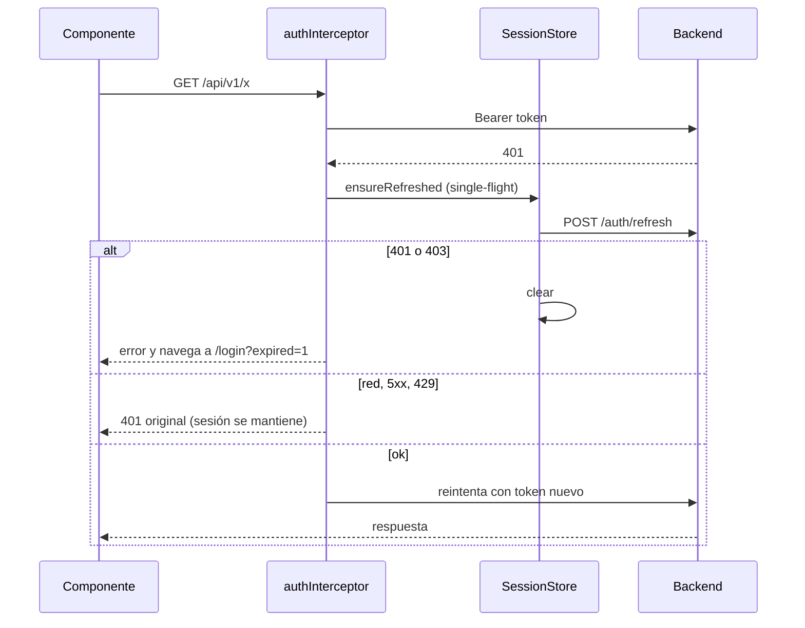
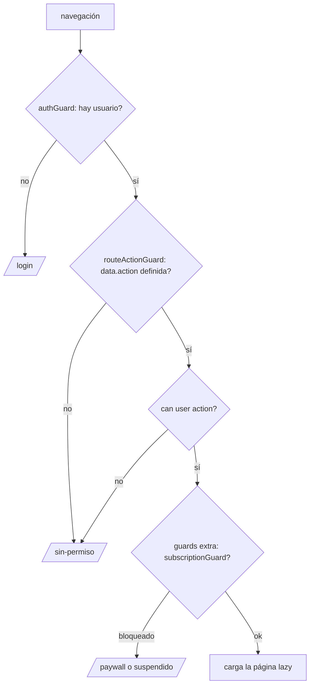
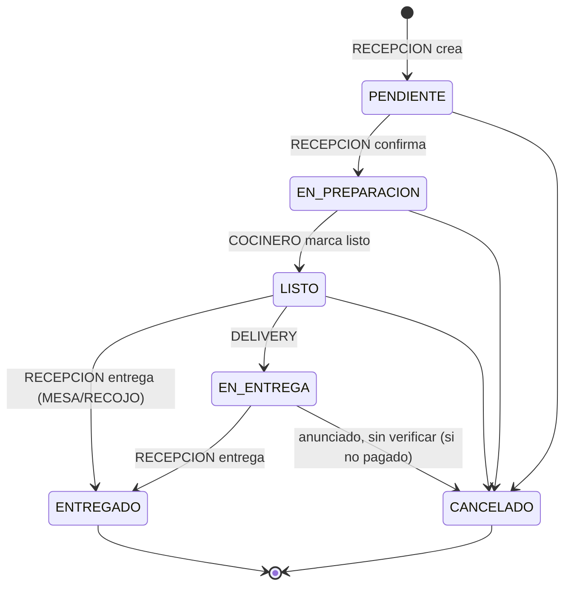
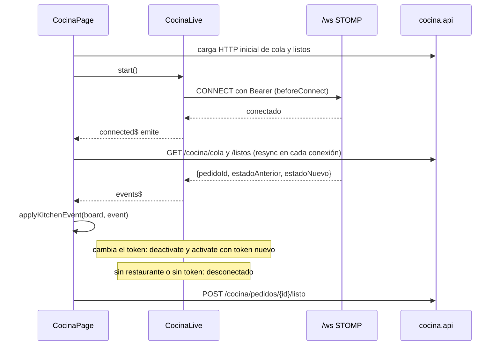

# Flujo del Sistema

> [!abstract] Contenido
> Diagramas derivados del código (`session.store.ts`, interceptores, guards, `cocina-live.ts`) y del documento de Flujo. El diagrama de cocina en vivo coincide con `cocina-live.ts` y `cocina.page.ts` (implementado, sin prueba manual).

Volver: [[00 - MOC]] · Relacionado: [[Seguridad]] · [[Modelo de Negocio]] · [[Cocina]] · [[API]]

## Arranque de la app

## Login

## Petición con refresh

## Decisión de guards al entrar a una ruta

## Ciclo de vida del pedido
Fuente: `docs/Flujo - Recepcion Cocina.md` regla 5 (más anuncios del 2026-10-08, sin verificar, marcados).

## Tablero de cocina en vivo

`applyKitchenEvent`: `EN_PREPARACION` pide refetch de cola; `LISTO` mueve la tarjeta localmente o pide refetch de listos; otro estado quita la tarjeta de donde estaba.
